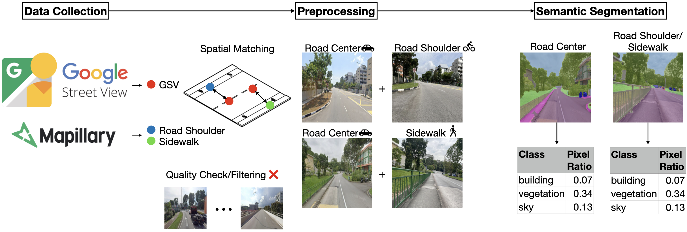

# Sidewalk the Talk: Translating street view imagery to correct perspectives to enhance bikeability and walkability studies

This repository is the official implementation of [Translating street view imagery to correct perspectives to enhance bikeability and walkability studies](https://doi.org/10.1080/13658816.2024.2391969).




## Structure
- `archive/` folder where previous code or code not being used is stored
- `road_shoulder_gan/` contains the entire original repo
- `docs/` documentation from cookiecutter
- `src/` is the codebase
- `reports/` output images

## Requirements

To install requirements:

```setup
pip install -r requirements.txt
```

Or if you use conda
```conda
conda env create --file environment.yaml
```

## Data preparation
`src/data/make_dataset.py` is the script to download the data from the source and prepare it for training

## Features
`src/features/build_features.py` is the script to build features from the images

## Models
`src/models/` contains the models used in the project

### Training and testing

The folder `configs/` have different `txt` files  where all the inline arguments (Argparse) are stored for easier management and reproducibility
Each argument name and its value are on a new line.
Boolean arguments don't need a `True` or `False` value.

To train the model(s) in the paper, you can run `src/models/train_model.py`

To test the model(s) in the paper, you can run `src/models/test_model.py`

## Pre-trained Models

You can download pretrained models on [figshare](https://figshare.com/articles/dataset/Data_and_code_for_Translating_street_view_imagery_to_correct_perspectives_to_enhance_bikeability_and_walkability_studies_/25532728/1?file=45432934)

## License

This project is licensed under the MIT License - see the [LICENSE](LICENSE) file for details.

## Paper and Citation

For more information, please refer to the paper: [Translating street view imagery to correct perspectives to enhance bikeability and walkability studies](https://doi.org/10.1080/13658816.2024.2391969).

Citation:
```bibtex
@article{ito2024translating,
  author = {Ito, Koichi and Quintana, Matias and Han, Xianjing and Zimmermann, Roger and Biljecki, Filip},
  title = {Translating street view imagery to correct perspectives to enhance bikeability and walkability studies},
  journal = {International Journal of Geographical Information Science},
  volume = {0},
  number = {0},
  pages = {1--31},
  year = {2024},
  publisher = {Taylor \& Francis},
  doi = {10.1080/13658816.2024.2391969},
  url = {https://doi.org/10.1080/13658816.2024.2391969}
}
```
